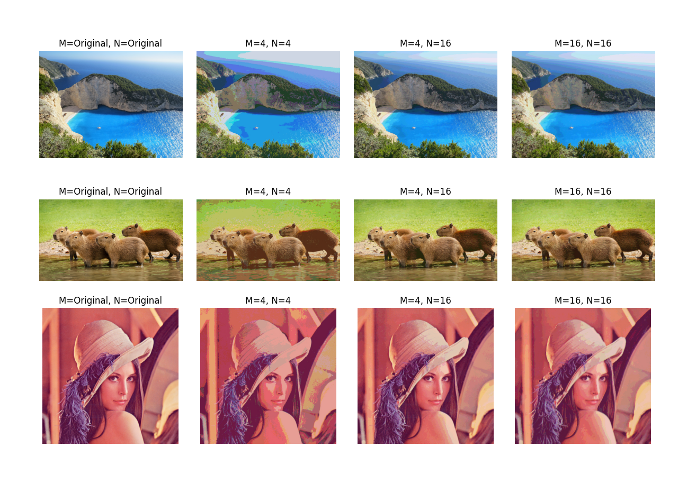

# CSCI596-Scientific-Computing-Visualization-Final-Project
This repository is for the Final Project of USC CSCI596 Scientific Computing &amp; Visualization

In this project, we have undertaken the implementation of Image Compression utilizing Vector Quantization through C++. The application allows user configurability for parameters such as 'M' and 'N,' where 'M' represents the size of the vectors, and 'N' denotes the number of vectors in the code book. Subsequently, we have introduced parallelization to the foundational program using [OpenMP](https://www.openmp.org/) to enhance computational efficiency. Following the implementation and parallelization phases, we rigorously tested and evaluated both programs within the [University of Southern California's Center for Advanced Research Computing (CARC) Discovery cluster environment](https://www.carc.usc.edu/user-information/user-guides/hpc-basics/getting-started-discovery). Finally, we have encapsulated the project with a comprehensive summary, available in this GitHub repository.

## Parallelize Image Compression with Vector Quantization

### Step 1: Understand Vector Quantization (VQ)
Vector Quantization is a technique used in image compression where blocks of pixels are replaced by a representative vector (codebook entry). The codebook is constructed by clustering similar vectors from the image.

Most natural images are not a random collection of pixels but have very smooth varying areas – where pixels are not changing rapidly. Consequently, we could pre-decide a codebook of vectors, each vector represented by a block of two pixels (or four pixels etc) and then replace all similar looking blocks in the image with one of the code vectors. The number of vectors, or the length of the code book used, will depend on how much error you are willing to tolerate in your compression. More vectors will result in larger coding indexes (and hence less compression) but results are perceptually better and vice versa. Thus vector quantization may be described as a lossy compression technique where groups or blocks of samples are given one index that represents a code word.

Pros:
- Blindingly fast decompression (often faster than simply copying the uncompressed data, orders of magnitude faster than decompressing PNGs or JPEGs)
- Good quality at excellent compression ratios
- A flexible choice of the trade-off between compression ratio and fidelity

Cons:
- **Very slow compression: compressing any practical amount of art assets is definitely an overnight batch job.**
- Nonstandard, not widely supported in hardware.


In response to the observed slow compression performance, a strategic decision has been made to address and optimize the compression process for increased efficiency.

### Step 2: Goal &amp; Framework
This image compression method, which intricately involves Codebook design, is inherently time-consuming, particularly in the processes of identifying the nearest code vectors and calculating vector distances. Aligned with the project's overarching goal, our concerted effort is directed towards optimizing the temporal efficiency of this method through the strategic implementation of parallelization techniques. To achieve this, the decision has been made to leverage OpenMP for parallelization, aiming to expedite the computational processes associated with Codebook design and ultimately enhance the overall performance of the image compression method.

### Step 3: Implementation

#### Step 3.1: Divide the Image
Divide the input image into smaller blocks or segments. Each block will be processed independently, enabling parallelization. The size of the blocks can be determined based on the available parallelization framework and the characteristics of the image.

Let’s look at the traditional Lena image below.


When creating a code book we need to decide two things – the size of the vector and the number of vectors. Assume we create a codebook of 2 pixel vectors. The space of all possible 2 pixel vectors is 256x256, and obviously not all of them are used. The image below shows a plot of which 2 pixels vectors are present in the image. Here a black dot shows a vector [pixel1, pixel2] being used in the image. This naturally is a sparse set because all combinations of [pixel1, pixel2] are not used. The diagonal line along which the density of the input vectors is concentrated is the x = y line. The areas on the diagram which would represent abrupt intensity changes from one pixel to the next are sparsely populated.


#### Step 3.2: Initialize Codebook
Initialize the codebook with representative vectors. This can be done by randomly selecting vectors from the input image or using a more sophisticated initialization method.

Assume we need to choose the N vectors of two pixels each that will best approximate this data set, noting that a possible best vector may not necessarily be present in the image but is part of the space. We could initialize codewords using a heuristic, which may help cut down the number of iterations of the next two steps or we may choose our initial codewords in a random manner. The figure below shows a uniform initialization for N=16 where the space of vectors is broken into 16 uniform cells and the center of each cell is chosen as the initial codeword.


Every pair from the input image pixels would be mapped to one of these red dots during the quantization. In other words - all vectors inside a cell would get quantized to the same codebook vector. Thus compression is achieved by mapping 2 pixels in the original image to an index which needs log(N) bits or 4 bits in this example. In other words we are compressing down to 2 bits per pixel.

While the compression ratio is good, we see why this quantization is very inefficient: Two of the cells are completely empty and four other cells are very sparsely populated. The codebook vectors in the six cells adjacent to the x = y diagonal are shifted away from the density maxima in their cells, which means that the average quantization error in these cells will be unnecessarily high. Thus, six of the 16 possible pairs of pixel values are wasted, six more are not used efficiently and only four seem probably well used. This results in large overall quantization error for all codewords, also known as the mean quantization error. The next steps aim to reduce this overall mean quantization error.

#### Step 3.3: Cluster Vectors
The figure below show a much better partitioning and assignment of codewords, which is how vector quantization should perform. The cells are smaller (that is, the quantization introduces smaller errors) where it matters the most—in the areas of the vector space where the input vectors are dense. No codebook vectors are wasted on unpopulated regions, and inside each cell the codebook vector is optimally spaced with regard to the local input vector density


Implement the clustering algorithm to group similar vectors together. Common algorithms include k-means clustering or hierarchical clustering. Ensure that the clustering algorithm is parallelized to handle different blocks concurrently.

#### Step 3.4: Update Codebook
After clustering, update the codebook by replacing each block with the representative vector of its cluster. This step may involve finding the centroid or median vector of each cluster.

This is done iteratively performing steps 3.3 and 3.4 together. Normally, no matter what the starting state is, uniformly appointed codewords or randomly selected codewords, this step should converge to the same result.

In step 3, we want to clusterize all the vectors, ie assign each vector to a codeword using the Euclidean distance measure. This is done by taking each input vector and finding the Euclidean distance between it and each codeword. The input vector belongs to the cluster of the codeword that yields the minimum distance.

In step 4 we compute a new set of codewords. This is done by obtaining the average of each cluster. Add the component of each vector and divide by the number of vectors in the cluster. The equation below gives the updated position of each codeword $y_i$ as the average of all vectors $x_{ij}$ assigned to cluster i, where m is the number of vectors in cluster i.

$$y_i = \frac{1}{m} \sum_{j=1}^{m} x_{ij}$$

Steps 3.3 and 3.4 should be repeated, updating the locations of codewords and their clusters iteratively until the codewords don’t change or the change in the codewords is small.

#### Step 3.5: Quantize Image
Apply the updated codebook to quantize the entire image. Replace each block with its corresponding codebook entry. Encode the quantized image, considering the indices of the codebook entries. The goal is to represent the image using a smaller number of bits.

The image below is the original image.


The image below is the image after compression with M=2 and N=8.


#### Step 3.6: Parallelize Compression Steps
Identify which steps of the compression process can be parallelized. For example, the clustering and codebook update steps can be parallelized across multiple processors or threads. Ensure that communication and synchronization are handled correctly in a distributed environment.


##### For step 3.1:
- **Data Setup**: We have a vector of custom objects (`std::vector<MyVectorExtra> vectors`).
Also, a private vector (`std::vector<MyVectorExtra> privateVectors`) is declared inside the parallel region.
- **Parallel Region**: We're using OpenMP (`#pragma omp`) to parallelize the following block of code. `private(privateVectors)` indicates that each thread gets its private copy of the `privateVectors` vector. `shared(vectors)` indicates that the `vectors` vector is shared among all threads.
- **Parallel Loop**: `#pragma omp for collapse(2)` parallelizes a nested loop (y and x).
The loop iterates through portions of the image (`img`) defined by `root` in both dimensions.
- **Vector Construction**: Inside the loop, we're extracting a block of pixels (`root x root`) from the image and creating a vector (`pixels`) from them. A custom object `MyVectorExtra` is then constructed from this vector of pixels. This custom object is then added to the private vector (`privateVectors`).
- **Critical Section**: After the parallel loop, a critical section (`#pragma omp critical`) is used to ensure that the shared `vectors` vector is updated safely. The private vectors (`privateVectors`) from each thread are appended to the shared `vectors` vector.

```C++
std::vector<MyVectorExtra> vectors;
std::vector<MyVectorExtra> privateVectors;
#pragma omp parallel private(privateVectors) shared(vectors)
{
    #pragma omp for collapse(2)
    for (int y = 0; y <= height - root; ++y) {
        for (int x = 0; x <= width - root; ++x) {
            std::vector<int> pixels;
            for (int i = 0; i < root; ++i) {
                for (int j = 0; j < root; ++j) {
                    pixels.push_back(img[(y * width + x + j + i * width) * 3 + offset]);
                }
            }
            MyVectorExtra vector(pixels);
            privateVectors.push_back(vector);
        }
    }

    #pragma omp critical
    vectors.insert(vectors.end(), privateVectors.begin(), privateVectors.end());
}
```

##### For step 3.3 and 3.4:

- **Initialization**: Initialize a boolean variable `change` to true, indicating the potential for changes in the code words. This process involves clustering vectors around code words and refining the code words iteratively.
- **Clustering and Refinement Loop**: Perform clustering and code word refinement in a loop until no significant change is detected. Clusters are represented as a vector of vectors (`clusters`) to hold vectors associated with each code word. Use OpenMP to parallelize the loop across threads for improved efficiency.
- **Parallel Loop**: Distribute the work among threads using OpenMP, where each thread processes a subset of vectors. Identify the nearest code word for each vector and update the corresponding cluster in a thread-safe manner.
- **Calculate New Code Words**: After clustering, calculate new code words by computing the average vector for each cluster.
- **Check for Convergence**: Compare the old and new code words to determine if a significant change has occurred. If no significant change is detected, set `change` to false, indicating convergence, and update the code words. If a change is detected, update the code words with the new ones.

```C++
bool change = true; // whether codewords change or the change in the codewords is small.
// Here, because of higher dimensional representations (higher M)
// the sensitivity to change will be reduced, because too many traversals will make the program run longer
while (change) {
    std::vector<std::vector<MyVectorExtra> > clusters(N);
    for (int i = 0; i < N; ++i) {
        clusters[i].clear();
    }

    #pragma omp parallel
    {
        int nthreads,tid;
        nthreads = omp_get_num_threads();
        tid = omp_get_thread_num();

        for (size_t i = tid; i < vectors.size(); i+=nthreads) {
            int nearestCodewordIndex = findNearestCodewordIndexExtra(vectors[i], codewords);
            #pragma omp critical
            clusters[nearestCodewordIndex].push_back(vectors[i]);
        }

    }

    std::vector<MyVectorExtra> newCodewords;
    for (int i = 0; i < N; ++i) {
        MyVectorExtra averageVector = averageVectorsExtra(clusters[i], M);
        newCodewords.push_back(averageVector);
    }

    if (!codewordsChangeExtra(codewords, newCodewords, N)) {
        change = false;
        codewords = newCodewords;
    } else {
        codewords = newCodewords;
    }
}
```

##### For step 3.5:
- **Initialization**: Utilize OpenMP to parallelize the quantization process for an image.
- **Parallel Loop**: Distribute the workload across threads using OpenMP. Each thread is assigned a unique thread ID (`tid`) and the total number of threads (`nthreads`).
- **Quantization Loop**: Nested loops iterate over blocks of pixels in the image. Each thread processes a specific range of rows (`y`) to parallelize the quantization. For each pixel block, create a vector (`pixels`) representing the pixel values.
- **Vector Quantization**: Convert the pixel vector into a custom object (`MyVectorExtra`). Find the nearest code word index for the vector using the function `findNearestCodewordIndexExtra`. Retrieve the quantized vector associated with the nearest code word.
- **Update Image**: Update the original image by replacing the pixel values in the block with the quantized values. The quantized values are obtained from the quantized vector associated with the nearest code word.

```C++
#pragma omp parallel
{
    int nthreads,tid;
    nthreads = omp_get_num_threads();
    tid = omp_get_thread_num();

    for (int y = tid; y <= height - root; y+=nthreads) {
        for (int x = 0; x <= width - root; ++x) {
            std::vector<int> pixels;
            for (int i = 0; i < root; ++i) {
                for (int j = 0; j < root; ++j) {
                    pixels.push_back(img[((y + i) * width + x + j) * 3 + offset]);
                }
            }

            MyVectorExtra vector(pixels);
            int nearestCodewordIndex = findNearestCodewordIndexExtra(vector, codewords);
            MyVectorExtra quantizedVector = codewords[nearestCodewordIndex];
            std::vector<int> quantizedPixels = quantizedVector.getPixels();

            int index = 0;
            for (int i = 0; i < root; ++i) {
                for (int j = 0; j < root; ++j) {
                    int quantizedPixel = quantizedPixels[index];
                    index++;
                    int outputIndex = ((y + i) * width + x + j) * 3 + offset;
                    img_compressed[outputIndex] = quantizedPixel;
                }
            }
        }
    }
}
```

### Step 4: Optimize and Test
In the pursuit of enhancing the performance of our parallelized code, we conducted thorough optimization experiments involving variations in block sizes, cluster counts, and compression parameters to identify the most effective configuration. Rigorous testing on diverse image datasets was undertaken to assess the parallelized image compression's overall effectiveness.

Following extensive testing, a notable observation emerged: when the size of vectors (M) is set to 2 or when the number of vectors in the code book (N) is small, the parallelized program exhibited negligible speedup. This phenomenon may be attributed to the potential overhead incurred by inter-thread communication, surpassing the optimization gains achieved in the program.

To address this, we opted to bifurcate the scenarios into two distinct cases: one where M is set to 2 and another where M takes on values other than 2. In the latter case, the entire logic is parallelized to capitalize on performance gains. However, in the former scenario (M=2), only the first and fifth steps are parallelized. This strategic decision resulted in improved performance, particularly when M or N assumes smaller values. The optimized program thus demonstrates a nuanced approach tailored to different scenarios, optimizing both computational and communication aspects for enhanced efficiency.

```C++
if (M == 2) {
    std::cout << "M = 2" << std::endl;
    std::cout << "Waiting for compressing..." << std::endl;
    for(int i=0; i<channels; i++){
        compressImage(M, N, i);
        std::cout << "Channels: " << i << " complete" << std::endl;
    }
} else {
    std::cout << "Extra: M = perfect square" << std::endl;
    std::cout << "Waiting for compressing..." << std::endl;
    for(int i=0; i<channels; i++){
        compressImageExtra(M, N, i);
        std::cout << "Channels: " << i << " complete" << std::endl;
    }
}
```

### Step 5: Evaluate Performance
Measure the performance of our parallelized image compression algorithm. Compare the execution time and compression ratio with a sequential implementation. Consider factors such as load balancing and scalability.

#### Step 5.1: Introduction
This report analyzes the performance of an image compression algorithm in its non-parallelized form (**image.cpp**) and after parallel optimization (**image_omp.cpp**). The study involves processing three images—Lenna.jpg, beach.jpg, and capybara.jpg—with varying parameters to evaluate the effectiveness of both algorithm versions.

The key metrics used for this analysis are compression time and compression ratio, providing insights into the efficiency and quality of compression. The focus is also on how the parallelized algorithm performs under different M, N values, and varying computational resources (number of tasks and CPUs per task). This comparison aims to highlight the enhancements parallel optimization brings to image compression, especially in terms of time efficiency and maintaining quality.

#### Step 5.2: Output of two algorithms
- **Output of non-parallelized image compression algorithm(image.cpp)**:


- **Output of parallelized image compression algorithm(image_omp.cpp)**:
Due to conducting tests with 54 different data sets on Carc to evaluate the parallelized algorithm, we have chosen the most representative set to showcase below. Presented are the output results for the beach image when processed with parameters m=4 and n=16.


#### Step 5.3: Analysis
#### Analysis of the average compression time and average compression ratio before and after parallelization.:


##### Average Compression Time Comparison (Left Chart)
- Different combinations of M,N have a significant effect on compression time. Whether parallel or non-parallel, specific combinations (e.g., smaller N values) resulted in less compression time.
- Across all M,N pairings, the average compression time is consistently lower in the *parallelized* environment compared to the *non-parallelized* setting, highlighting the time-saving benefits of parallel optimization.

##### Average Compression Ratio Comparison (Right Chart)
- The comparison of average compression ratios shows negligible variation between the *non-parallelized* and *parallelized* environments, indicating that enhancements from parallelization focus on time efficiency rather than altering compression quality.
- The stability in compression ratios across different computational settings affirms the robustness of the compression algorithm, ensuring consistent output quality regardless of parallel processing.

##### Conclusion
- The analysis delineates that while the *parallelized* environment offers significant improvements in compression times, it does not compromise the compression ratio, signifying an effective and consistent algorithm across both *non-parallelized* and *parallelized* scenarios.
- The uniformity in compression ratios between *non-parallelized* and *parallelized* setups underscores the algorithm's reliability, demonstrating its capability to deliver stable performance across various hardware and configuration spectrums.
- These findings are instrumental in understanding the performance of the compression algorithm across different environments, especially when evaluating the trade-off between parallel computing resources and desired compression results.

#### The impact of different Carc parameters on the average compression time and average compression ratio after parallelization, under the same M, N settings.:


##### Average Compression Time Analysis (Left Chart)
- The compression time varies across different combinations of `Ntasks` and `CpusPerTask`, indicating a significant impact of task count and CPU cores per task on the algorithm's execution time.
- Some parameter combinations, such as `2,4` and `4,4`, show reduced compression times, possibly indicating effective utilization of parallel resources.
- Not all parameter combinations lead to reduced compression times. For example, `4,2` shows a relatively longer compression time, which may be due to improper resource allocation or other bottlenecks in parallel processing.

##### Average Compression Ratio Analysis (Right Chart)
- The compression ratio remains relatively unchanged across different `Ntasks` and `CpusPerTask` combinations, suggesting that while parallel optimization significantly speeds up computation, it has little impact on compression quality.
- The compression ratio stays at a nearly consistent level for most parameter combinations, indicating that the algorithm can maintain quality while improving efficiency in a parallel processing context.
- Each bar in the chart represents the average compression ratio for a specific `Ntasks,CpusPerTask` combination. Despite the variety in parameter configurations, the variation in compression ratios across configurations is minimal.

##### Conclusion
- Choosing the appropriate combination of `Ntasks` and `CpusPerTask` is crucial for optimizing compression performance in a parallel environment. Proper resource allocation can significantly reduce compression time without sacrificing compression quality.
- These analyses provide insights into how parallel algorithms perform in real-world settings and can assist decision-makers in making more informed resource allocation decisions when deploying similar algorithms.

#### Influence of different images on the efficiency and quality of parallelization.:
<p align="center">
  
</p>
<p align="center">
  
</p>

- The `Capybara` image shows the most significant reduction in compression time with a negligible change in compression ratio, indicating that parallel optimization was highly effective for this image. This suggests that images similar to the Capybara one, which likely contains large uniform regions, benefit greatly from parallel optimization in terms of speed, without sacrificing the quality of compression.

- The `Beach` image also shows a considerable reduction in time, although less than the Capybara image, with a very small change in the compression ratio. This indicates that images with a mix of uniform and detailed regions also benefit from parallel optimization, but perhaps not to the same extent as more uniform images.

- The `Lenna` image, while still showing a significant reduction in time, has a more noticeable increase in the compression ratio. This suggests that while parallel optimization improves the speed of compression, there might be a slight trade-off in quality for images with complex textures and details.

##### Conclusion:
Based on this analysis, images like Capybara, which likely have large uniform regions, are more suitable for parallel optimization because they show the most significant improvement in compression time with minimal impact on the compression ratio. Images with more complex details, like Lenna, may still benefit in terms of time, but the optimization might need careful adjustment to maintain compression quality.

#### Step 5.4: Summary
##### Server Environment and Parallel Optimization
- Parallel optimization in a server environment significantly enhances the time efficiency of the compression algorithm, which is beneficial for scenarios requiring rapid processing of large volumes of image data.
- A comparison of compression ratios indicates that parallel optimization does not sacrifice image quality, marking a crucial indicator of successful algorithm optimization.
- To maximize efficiency and performance, cluster parameters must be carefully selected to adjust and optimize resource utilization based on the specific application and image dataset.

##### Image Suitability for Parallel Optimization
- According to the analysis, images with large uniform areas, like 'Capybara', are more suited to parallel optimization as they show the most significant improvement in compression time with minimal impact on the compression ratio.
- For images with more complex details, like 'Lenna', while time benefits can still be realized, optimization may require careful adjustment to maintain compression quality.


### Step 6: Document and Report
Our documentation meticulously outlines the intricacies of our parallelization strategy, encompassing a detailed exposition of the algorithms employed, the strategic implementation of data structures, and the integration of parallelization frameworks. This comprehensive documentation serves as an invaluable resource, providing clarity on the key facets of our image compression project.

We are committed to preparing a comprehensive report that distills our findings throughout the parallelization process. This report will include meticulous performance comparisons, shedding light on the efficiency gains achieved under various configurations and input sizes. Moreover, we will transparently articulate the challenges encountered during the parallelization journey, offering insights into the problem-solving strategies and optimizations applied.

Given that our primary presentation medium is GitHub, we recognize the paramount importance of documenting all aspects within our repository. The ReadMe file, as the central hub of information, will elucidate the project's overarching goals, the methodologies employed, and the rationale behind critical decisions. This approach ensures that our GitHub repository serves as a complete and accessible repository of knowledge, providing clarity for collaborators, contributors, and stakeholders engaging with our image compression project.

### Step 7: Team Member Contributions
This section outlines the distinctive contributions made by each team member to our collaborative project. Each member has brought a unique set of skills, expertise, and dedication to the table, contributing significantly to the overall success of the initiative. The collective efforts of the team members have resulted in a comprehensive and well-executed project. Below is a summary of individual contributions:

**Junmeng Xu**:
- In this project, I spearheaded the development of the fundamental image compression program. Leveraging my expertise in C++, I crafted the core functionality that forms the backbone of our image compression solution. A pivotal aspect of my contribution was the strategic integration of OpenMP to parallelize critical components of the program, enhancing its computational efficiency.

- Half of the README file encapsulates a comprehensive summary of my contributions, outlining the intricacies of the image compression algorithm, the rationale behind parameter configurations such as 'M' and 'N,' and the optimization achieved through parallelization. This section serves as a testament to the meticulous planning, implementation, and dedication invested in ensuring the success of our image compression project.

**Yiyuan Gao**: 
- **Algorithm Selection and Improvement**: Suggested and advised on the choice and refinement of algorithms to enhance the efficiency and effectiveness of image compression techniques.

- **Code Development for Evaluation**: Authored and maintained the codebase required to assess the performance of the compression algorithms before and after parallelization.

- **Parameter Impact Assessment**: Conducted a thorough analysis to evaluate the influence of various parameters on the parallelization process, ensuring an optimized configuration for different use cases.

- **Batch Testing**: Implemented a systematic approach for batch testing, allowing for extensive and rigorous evaluation of the algorithms under varied conditions and scenarios.

- **Report and Chart Generation**: Produced comprehensive reports and detailed analytical charts, presenting clear and actionable insights into the performance and capabilities of the compression algorithms post-optimization.

By acknowledging and documenting the diverse contributions of each team member, we ensure that the team's collaborative efforts and individual strengths are appropriately recognized and celebrated.

### Step 8: Summary
In this project, our focus centered on the implementation of Image Compression using Vector Quantization in C++. We took a pivotal step towards enhancing user configurability by introducing parameters 'M' and 'N,' where 'M' signifies vector size, and 'N' represents the number of vectors in the code book. To fortify the computational efficiency of our foundational program, we strategically incorporated OpenMP for parallelization.

A significant milestone in our journey involved rigorous testing and evaluation of both the original and parallelized programs. This evaluation took place within the robust computing environment of the University of Southern California's Center for Advanced Research Computing (CARC) Discovery cluster. The utilization of parallelization techniques yielded substantial improvements, optimizing the speed of our image compression processes.

Our GitHub repository encapsulates the entirety of our project, offering a comprehensive summary of our efforts, implementations, and outcomes. This project showcases a successful convergence of theoretical concepts, practical implementations, and parallelization strategies, culminating in an optimized and efficient image compression solution.
